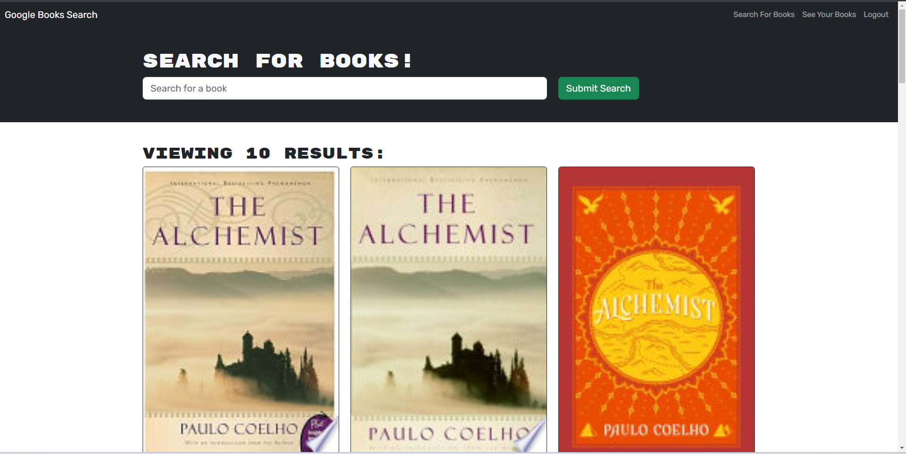

# BookSearchEngine

  
   

  ## Table of Contents
  - [Description](#description)
  - [Installation](#installation)
  - [Usage](#usage)
  - [Credits](#credits)
  - [License](#license)
  - [Contributing](#contributing)
  - [Test](#tests)
  - [Questions](#questions)

  ## Description
  - A web application to search for books.
  - Users are able to register and once they signed in they can search for books.
  - User's can save books to their favororites and also remove them from there if they wish to..
  - The website uses authentication to verify the users' identity.
  - Users are able to logout the website.
  - [ Video link](https://drive.google.com/file/d/1AKkGT7Yh5xzplMMJqgTtfwYmNdO8SThJ/view)

  ## Installation

  - the web application can be accessed without any installations, just go visit the site and sign in!

  ## Usage
  -Sign up

  -Search for books

  -Save books to favorites

  

  ## Credits
  The starter code was provided by Xander Rapstine

  ## License
  This project is licensed under [MIT license](https://opensource.org/licenses/MIT)

  ## Contributing
 Yemny Feliz 

  ## Tests
  N/A

  ## Questions
  If you have any questions about this project please contact me:
  - GitHub: [@YemnyFeliz](https://github.com/YemnyFeliz)
  - Email: y.feliz1296@gmail.com